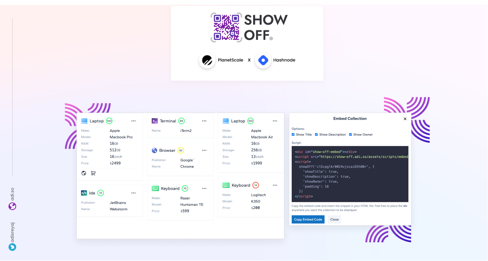

<p align="center">
  <a href="https://github.com/adisreyaj/show-off">
    
  </a>

<h3 align="center">Show Off - Showcase your setup!</h3>

  <p align="center">
    How often do you get asked about the gadgets or software that you use? If the answer is quite often, you should be trying show off out. Curate the list of gadgets and software and share it with your fans and followers.
    <br />
    <br />
    <a href="https://show-off.adi.so">View Demo</a>
    ·
    <a href="https://github.com/adisreyaj/show-off/issues">Report Bug</a>
    ·
    <a href="https://github.com/adisreyaj/show-off/issues">Request Feature</a>
  </p>

<p align="center">
  
</p>
</p>

---

<p align="center">
  
</p>

## Features ✨

1. Multiple Collections
2. Built for developers, designers, and content creators
3. Share & Embed
4. Private collections
5. Like and Comments
6. Recommendation Meter
7. Affiliate Links

Detailed blog post: https://sreyaj.dev/show-off-showcase-your-setup-planetscale-hashnode-hackathon

## Running Locally 💻

#### #1. Clone the repo

```sh
git clone https://github.com/adisreyaj/show-off.git
```

#### #2. Initialize the submodule (zigzag)

```sh
git submodule update --init
```

#### #3. Install the dependencies

```sh
npm install
```

#### #4. Install Peer deps for zigzag

```sh
npm i @floating-ui/dom
```

#### #5. Setup the environment variables

Set up all the required environment variables required for the back-end:

```
DATABASE_URL=mysql://localhost:3309/show-off

NODE_ENV=development
FRONT_END_CALLBACK_URL=http://localhost:4200/auth/callback

# JWT sign secret
JWT_SECRET=very_very_strong_secret_key
JWT_EXPIRY="3d"
COOKIE_SECRET=very_very_strong_secret_session_key

# Google OAuth Details
GOOGLE_CLIENT_ID=xxxxx.googleusercontent.com
GOOGLE_CLIENT_SECRET=xxxxxxx
GOOGLE_CALLBACK_URI=http://localhost:3333/api/auth/google/callback

# Github OAuth Details
GITHUB_CLIENT_ID=Iv1.xxxxxxxxxx
GITHUB_CLIENT_SECRET=xxxxxx
GITHUB_CALLBACK_URI=http://localhost:3333/api/auth/github/callback
```

#### #6. Set up the Database

Run the command to populate the DB with tables:

```sh
npm run prisma:push
```

#### #7. Start up the UI and Back-end

For UI:

```sh
npm start show-off
```

For Back-end

```sh
npm start api
```

UI: `http://localhost:4200` & GQL: `http://localhost:3333`

## Links and References 🔗

| Title        | Link                            | Description                                      |
|--------------|---------------------------------|--------------------------------------------------|
| Angular      | https://angular.io/             | Front-end framework                              |
| NestJs       | https://docs.nestjs.com/        | Back-end framework based on NodeJs               |
| PlanetScale      | https://www.planetscale.com/        | MySQL Compatible DB                              |
| Prisma       | https://www.prisma.io/          | Node.js and TypeScript ORM                       |
| Tailwind CSS | https://tailwindcss.com/        | Utility first CSS framework                      |
| Nx           | https://nx.dev/#getting-started | Build system with monorepo support               |
| PM2          | https://app.pm2.io/             | Advanced, production process manager for Node.JS |

## Roadmap

See the [open issues](https://github.com/adisreyaj/show-off/issues) for a list of proposed features (and known issues).

## License

Distributed under the Apache 2.0 License. See `LICENSE` for more information.

## Show your support

Please ⭐️ this repository if this project helped you!

Made as part of [PlanetScale](https://planetscale.com) x [Hashnode](https://hashnode.com) hackathon.
